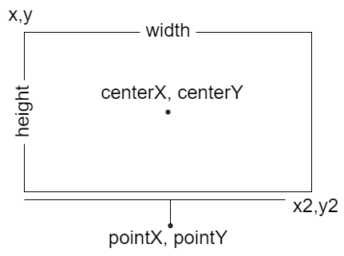

# 2.x Migration guide

`chartjs-plugin-annotation` plugin version 2 introduces a number of breaking changes. In order to improve performance, offer new features, and improve maintainability, it was necessary to break backwards compatibility, but we aimed to do so only when worth the benefit.

## Chart.js version

The annotation plugin requires at least version 3.7.0 to work because of some bug fixes that happend within chart.js itself.

## Options

A number of changes were made to the configuration options passed to the plugin configuration. Those changes are documented below.

 * `xScaleID` option default has been changed, now set to `undefined`. If the option is missing, the plugin will try to use the first scale of the chart, configured as `'x'` axis. If more than one scale has been defined in the chart as `'x'` axis, the option is mandatory to select the right scale.
 * `yScaleID` option default has been changed, now set to `undefined`. If the option is missing, the plugin will try to use the first scale of the chart, configured as `'y'` axis. If more than one scale has been defined in the chart as `'y'` axis, the option is mandatory to select the right scale.
 * When [stacked scales](https://www.chartjs.org/docs/latest/axes/cartesian/#common-options-to-all-cartesian-axes) are used, instead of the whole chart area, the designated scale area is used as fallback for `xMin`, `xMax`, `yMin`, `yMax`, `xValue` or `yValue` options.
 * `cornerRadius` option was replaced by `borderRadius` in the box annotation configuration and in the label configuration of line annotation to align with Chart.js options.
 * `xPadding` and `yPadding` options were merged into a single `padding` object in the label configuration of line annotation to align with Chart.js options.
 * `enabled` option was replaced by `display` in the callout configuration of label annotation, in the label configuration of line and box annotations and in the arrow heads configuration of line annotation to have the same option on all elements.
 * `dblClickSpeed` option was removed from the plugin options because `dblclick` event hook is not available anymore.

## Elements

`chartjs-plugin-annotation` plugin version 2 hides the following methods in the `line` annotation element because they should be used only internally:

 * `intersects`
 * `labelIsVisible`
 * `isOnLabel`

`chartjs-plugin-annotation` plugin version 2 normalizes the properties of the annotation elements in order to be based on common box model.

#### Box annotation

The following diagram is showing the element properties about a `'box'` annotation:

#### Ellipse annotation

The following diagram is showing the element properties about a `'ellipse'` annotation:

#### Label annotation

The following diagram is showing the element properties about a `'label'` annotation:

#### Line annotation

The following diagram is showing the element properties about a `'line'` annotation and the inner label:

#### Point annotation

The following diagram is showing the element properties about a `'point'` annotation:

#### Polygon annotation

The following diagram is showing the element properties about a `'polygon'` annotation:

## Events

`chartjs-plugin-annotation` plugin version 2 introduces the [`interaction`](options#interaction) options, to configure which events trigger annotation interactions. By default, the plugin uses the [chart interaction configuration](https://www.chartjs.org/docs/latest/configuration/interactions.html#interactions).

 * When [scatter charts](https://www.chartjs.org/docs/latest/charts/scatter.html) are used, the interaction default `mode` in Chart.js is `point`, while, in the previous plugin version, the default was `nearest`.

The `dblclick` event hook was removed from annotations options because, being executed asynchronously, it can not enable the chart re-rendering, automatically after processing the event completely. This is important when the user requires re-draws. It gets slow and messy if every event hook does the draw (or update!).
