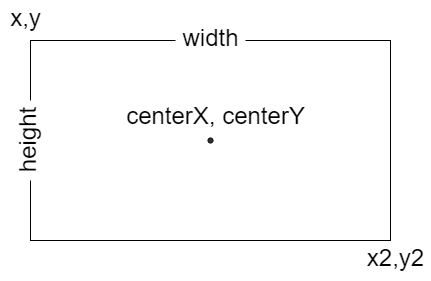

# Doughnut Label Annotations

Doughnut label annotations are used to add contents (text, image, canvas) in the middle area of the doughnut charts.

```js chart-editor
/* <block:options:0> */
const options = {
  plugins: {
    annotation: {
      annotations: {
        dLabel: {
          type: 'doughnutLabel',
          content: ({chart}) => ['Total',
            chart.getDatasetMeta(0).total,
            'last 7 months'
          ],
          font: [{size: 60}, {size: 50}, {size: 30}],
          color: ['black', 'red', 'grey']
        }
      }
    }
  }
};
/* </block:options> */

/* <block:config:1> */
const config = {
  type: 'doughnut',
  data: {
    labels: ['January', 'February', 'March', 'April', 'May', 'June', 'July'],
    datasets: [{
      label: 'Amount',
      data: [65, 59, 80, 81, 56, 55, 40]
    }]
  },
  options
};
/* </block:config> */

module.exports = {
  config
};
```

## Configuration

### Options

The following options are available for label annotations.

| Name | Type | [Scriptable](../options.md#scriptable-options) | Default
| ---- | ---- | :----: | ----
| [`autoHide`](#general) | `boolean` | Yes | `true`
| [`autoFit`](#general) | `boolean` | Yes | `true`
| [`backgroundColor`](#styling) | [`Color`](../options.md#color) | Yes | `'transparent'`
| [`backgroundShadowColor`](#styling) | [`Color`](../options.md#color) | Yes | `'transparent'`
| [`borderColor`](#styling) | [`Color`](../options.md#color) | Yes | `'transparent'`
| [`borderDash`](#styling) | `number[]` | Yes | `[]`
| [`borderDashOffset`](#styling) | `number` | Yes | `0`
| [`borderShadowColor`](#styling) | [`Color`](../options.md#color) | Yes | `'transparent'`
| [`display`](#general) | `boolean` | Yes | `true`
| [`drawTime`](#general) | `string` | Yes | `'afterDatasetsDraw'`
| [`borderJoinStyle`](#styling) | `string` | Yes | `'miter'`
| [`borderWidth`](#styling) | `number`| Yes | `0`
| [`color`](#styling) | [`Color`\|`Color[]`](../options.md#color) | Yes | `'black'`
| [`content`](#general) | `string`\|`string[]`\|[`Image`](https://developer.mozilla.org/en-US/docs/Web/API/HTMLImageElement/Image)\|[`HTMLCanvasElement`](https://developer.mozilla.org/en-US/docs/Web/API/HTMLCanvasElement) | Yes | `null`
| [`font`](#styling) | [`Font`\|`Font[]`](../options.md#font) | Yes | `{}`
| [`height`](#general) | `number`\|`string` | Yes | `undefined`
| [`id`](#general) | `string` | No | `undefined`
| [`position`](#position) | `string`\|`{x: string, y: string}` | Yes | `'center'`
| [`rotation`](#general) | `number`| Yes | `0`
| [`shadowBlur`](#styling) | `number` | Yes | `0`
| [`shadowOffsetX`](#styling) | `number` | Yes | `0`
| [`shadowOffsetY`](#styling) | `number` | Yes | `0`
| [`spacing`](#general) | `number`| Yes | `1`
| [`textAlign`](#general) | `string` | Yes | `'center'`
| [`textStrokeColor`](#styling) | [`Color`](../options.md#color) | Yes | `undefined`
| [`textStrokeWidth`](#styling) | `number` | Yes | `0`
| [`width`](#general) | `number`\|`string` | Yes | `undefined`
| [`xAdjust`](#general) | `number` | Yes | `0`
| [`yAdjust`](#general) | `number` | Yes | `0`

### General

The content will be rendered in the center of the chart.

| Name | Description
| ---- | ----
| `autoFit` | If `true`, the label will be automatically fit inside the chart if its dimension is bigger than the available space.
| `autoHide` | If `true`, the label will be automatically hidden if the dataset or its data items will be all hidden.
| `content` | The content to show in the annotation.
| `display` | Whether or not this annotation is visible.
| `drawTime` | See [drawTime](../options.md#draw-time).
| `height` | Overrides the height of the image or canvas element. Could be set in pixel by a number, or in percentage of current height of image or canvas element by a string. If undefined, uses the height of the image or canvas element. It is used only when the content is an image or canvas element.
| `id` | Identifies a unique id  for the annotation and it will be stored in the element context. When the annotations are defined by an object, the id is automatically set using the key used to store the annotations in the object. When the annotations are configured by an array, the id, passed by this option in the annotation, will be used. 
| `rotation` | Rotation of the label in degrees.
| `spacing` | The space in pixels between the inner radius of the chart and the background of the label.
| `textAlign` | Text alignment of label content when there's more than one line. Possible options are: `'left'`, `'start'`, `'center'`, `'end'`, `'right'`.
| `width` | Overrides the width of the image or canvas element. Could be set in pixel by a number, or in percentage of current width of image or canvas element by a string. If undefined, uses the width of the image or canvas element. It is used only when the content is an image or canvas element.
| `xAdjust` | Adjustment of label relative to computed position. Negative values move the label left, positive right.
| `yAdjust` | Adjustment along y-axis (top-bottom) of label relative to computed position. Negative values move the label up, positive down.

### Styling

| Name | Description
| ---- | ----
| `backgroundColor` | Fill color.
| `backgroundShadowColor` | The color of shadow. See [MDN](https://developer.mozilla.org/en-US/docs/Web/API/CanvasRenderingContext2D/shadowColor).
| `borderColor` | Stroke color.
| `borderDash` | Length and spacing of dashes. See [MDN](https://developer.mozilla.org/en-US/docs/Web/API/CanvasRenderingContext2D/setLineDash).
| `borderDashOffset` | Offset for border line dashes. See [MDN](https://developer.mozilla.org/en-US/docs/Web/API/CanvasRenderingContext2D/lineDashOffset).
| `borderJoinStyle` | Border line join style. See [MDN](https://developer.mozilla.org/en-US/docs/Web/API/CanvasRenderingContext2D/lineJoin).
| `borderShadowColor` | The color of the border shadow. See [MDN](https://developer.mozilla.org/en-US/docs/Web/API/CanvasRenderingContext2D/shadowColor).
| `borderWidth` | Stroke width (in pixels).
| `color` | Text color. When the label to draw has multiple lines, you can use different color for each row of the label. This is enabled configuring an array of colors. When the lines are more than the configured colors, the last configuration of this option is used for all remaining lines.
| `font` | Text font. When the label to draw has multiple lines, you can use different font for each row of the label. This is enabled configuring an array of fonts. When the lines are more than the configured fonts, the last configuration of this option is used for all remaining lines.
| `shadowBlur` | The amount of blur applied to shadow of the box where the label is located. See [MDN](https://developer.mozilla.org/en-US/docs/Web/API/CanvasRenderingContext2D/shadowBlur).
| `shadowOffsetX` | The distance that shadow, of the box where the label is located, will be offset horizontally. See [MDN](https://developer.mozilla.org/en-US/docs/Web/API/CanvasRenderingContext2D/shadowOffsetX).
| `shadowOffsetY` | The distance that shadow, of the box where the label is located, will be offset vertically. See [MDN](https://developer.mozilla.org/en-US/docs/Web/API/CanvasRenderingContext2D/shadowOffsetY).
| `textStrokeColor` | The color of the stroke around the text.
| `textStrokeWidth` | Stroke width around the text.

### Position

A position can be set in 2 different values types:

1. `'start'`, `'center'`, `'end'` which are defining where the label will be located
2. a `string`, in percentage format `'number%'`, is representing the percentage on the size where the label will be located

If this value is a string (possible options are `'start'`, `'center'`, `'end'` or a string in percentage format), it is applied to vertical and horizontal position in the box.

If this value is an object, the `x` property defines the horizontal alignment in the label, with respect to the center point of the chart. Similarly, the `y` property defines the vertical alignment in the label, with respect to the center point of the chart. Possible options for both properties are `'start'`, `'center'`, `'end'`, a string in percentage format. Omitted property have value of the default, `'center'`.

#### borderRadius

If this value is a number, it is applied to all corners of the rectangle (topLeft, topRight, bottomLeft, bottomRight). If this value is an object, the `topLeft` property defines the top-left corners border radius. Similarly, the `topRight`, `bottomLeft`, and `bottomRight` properties can also be specified. Omitted corners have radius of 0.

## Element

The following diagram is showing the element properties about a `'doughnutLabel'` annotation:


