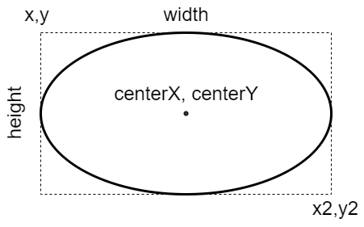

# Ellipse Annotations

Ellipse annotations are used to draw circles on the chart area. This can be useful for highlighting different areas of a chart.

```js chart-editor
/* <block:options:0> */
const options = {
  plugins: {
    annotation: {
      annotations: {
        ellipse1: {
          type: 'ellipse',
          xMin: 1,
          xMax: 2,
          yMin: 50,
          yMax: 70,
          backgroundColor: 'rgba(255, 99, 132, 0.25)'
        }
      }
    }
  }
};
/* </block:options> */

/* <block:config:1> */
const config = {
  type: 'line',
  data: {
    labels: ['January', 'February', 'March', 'April', 'May', 'June', 'July'],
    datasets: [{
      label: 'My First Dataset',
      data: [65, 59, 80, 81, 56, 55, 40],
      fill: false,
      borderColor: 'rgb(75, 192, 192)',
      tension: 0.1
    }]
  },
  options
};
/* </block:config> */

module.exports = {
  config
};
```

## Configuration

### Ellipse annotation specific options

The following options are available for ellipse annotations.

| Name | Type | [Scriptable](../options.md#scriptable-options) | Default
| ---- | ---- | :----: | ----
| [`backgroundShadowColor`](#styling) | [`Color`](../options.md#color) | Yes | `'transparent'`
| [`borderWidth`](#styling) | `number`| Yes | `1`
| [`label`](#label) | `object` | Yes |
| [`rotation`](#general) | `number`| Yes | `0`

!!!include(./guide/types/_commonOptions.md)!!!

### General

If one of the axes does not match an axis in the chart, the ellipse will take the entire chart dimension. The 4 coordinates, xMin, xMax, yMin, yMax are optional. If not specified, the ellipse is expanded out to the edges in the respective direction.

| Name | Description
| ---- | ----
| `adjustScaleRange` | Should the scale range be adjusted if this annotation is out of range.
| `display` | Whether or not this annotation is visible.
| `drawTime` | See [drawTime](../options.md#draw-time).
| `id` | Identifies a unique id  for the annotation and it will be stored in the element context. When the annotations are defined by an object, the id is automatically set using the key used to store the annotations in the object. When the annotations are configured by an array, the id, passed by this option in the annotation, will be used. 
| `rotation` | Rotation of the ellipse in degrees, default is 0.
| `xMax` | Right edge of the ellipse in units along the x axis.
| `xMin` | Left edge of the ellipse in units along the x axis.
| `xScaleID` | ID of the X scale to bind onto. If missing, the plugin will try to use the scale of the chart, configured as `'x'` axis. If more than one scale has been defined in the chart as `'x'` axis, the option is mandatory to select the right scale.
| `yMax` | Bottom edge of the ellipse in units along the y axis.
| `yMin` | Top edge of the ellipse in units along the y axis.
| `yScaleID` | ID of the Y scale to bind onto. If missing, the plugin will try to use the scale of the chart, configured as `'y'` axis. If more than one scale has been defined in the chart as `'y'` axis, the option is mandatory to select the right scale.
| `z` | The `z` property determines the drawing stack level of the ellipse annotation element. All visible elements will be drawn in ascending order of `z` option, with the same `drawTime` option.

### Styling

| Name | Description
| ---- | ----
| `backgroundColor` | Fill color.
| `backgroundShadowColor` | The color of shadow. See [MDN](https://developer.mozilla.org/en-US/docs/Web/API/CanvasRenderingContext2D/shadowColor).
| `borderColor` | Stroke color.
| `borderDash` | Length and spacing of dashes. See [MDN](https://developer.mozilla.org/en-US/docs/Web/API/CanvasRenderingContext2D/setLineDash).
| `borderDashOffset` | Offset for line dashes. See [MDN](https://developer.mozilla.org/en-US/docs/Web/API/CanvasRenderingContext2D/lineDashOffset).
| `borderShadowColor` | The color of the border shadow. See [MDN](https://developer.mozilla.org/en-US/docs/Web/API/CanvasRenderingContext2D/shadowColor).
| `borderWidth` | Stroke width.
| `shadowBlur` | The amount of blur applied to shadow. See [MDN](https://developer.mozilla.org/en-US/docs/Web/API/CanvasRenderingContext2D/shadowBlur).
| `shadowOffsetX` | The distance that shadow will be offset horizontally. See [MDN](https://developer.mozilla.org/en-US/docs/Web/API/CanvasRenderingContext2D/shadowOffsetX).
| `shadowOffsetY` | The distance that shadow will be offset vertically. See [MDN](https://developer.mozilla.org/en-US/docs/Web/API/CanvasRenderingContext2D/shadowOffsetY).

!!!include(./guide/types/_commonInnerLabel.md)!!!

## Element

The following diagram is showing the element properties about a `'ellipse'` annotation:


