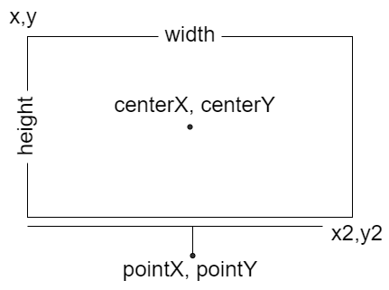

# Label Annotations

Label annotations are used to add contents on the chart area. This can be useful for describing values that are of interest.

```js chart-editor
/* <block:options:0> */
const options = {
  plugins: {
    annotation: {
      annotations: {
        label1: {
          type: 'label',
          xValue: 2.5,
          yValue: 60,
          backgroundColor: 'rgba(245,245,245)',
          content: ['This is my text', 'This is my text, second line'],
          font: {
            size: 18
          }
        }
      }
    }
  }
};
/* </block:options> */

/* <block:config:1> */
const config = {
  type: 'line',
  data: {
    labels: ['January', 'February', 'March', 'April', 'May', 'June', 'July'],
    datasets: [{
      label: 'My First Dataset',
      data: [65, 59, 80, 81, 56, 55, 40],
      fill: false,
      borderColor: 'rgb(75, 192, 192)',
      tension: 0.1
    }]
  },
  options
};
/* </block:config> */

module.exports = {
  config
};
```

## Configuration

### Label annotation specific options

The following options are available for label annotations.

| Name | Type | [Scriptable](../options.md#scriptable-options) | Default
| ---- | ---- | :----: | ----
| [`backgroundShadowColor`](#styling) | [`Color`](../options.md#color) | Yes | `'transparent'`
| [`borderCapStyle`](#styling) | `string` | Yes | `'butt'`
| [`borderJoinStyle`](#styling) | `string` | Yes | `'miter'`
| [`borderRadius`](#borderradius) | `number` \| `object` | Yes | `0`
| [`borderWidth`](#styling) | `number`| Yes | `0`
| [`callout`](#callout) | `object` | Yes |
| [`color`](#styling) | [`Color`\|`Color[]`](../options#color) | Yes | `'black'`
| [`content`](#general) | `string`\|`string[]`\|[`Image`](https://developer.mozilla.org/en-US/docs/Web/API/HTMLImageElement/Image)\|[`HTMLCanvasElement`](https://developer.mozilla.org/en-US/docs/Web/API/HTMLCanvasElement) | Yes | `null`
| [`font`](#styling) | [`Font`\|`Font[]`](../options#font) | Yes | `{}`
| [`height`](#general) | `number`\|`string` | Yes | `undefined`
| [`opacity`](#styling) | `number` | Yes | `undefined`
| [`padding`](#general) | [`Padding`](../options.md#padding) | Yes | `6`
| [`position`](#position) | `string`\|`{x: string, y: string}` | Yes | `'center'`
| [`rotation`](#general) | `number`| Yes | `0`
| [`textAlign`](#general) | `string` | Yes | `'center'`
| [`textStrokeColor`](#styling) | [`Color`](../options.md#color) | Yes | `undefined`
| [`textStrokeWidth`](#styling) | `number` | Yes | `0`
| [`width`](#general) | `number`\|`string` | Yes | `undefined`
| [`xAdjust`](#general) | `number` | Yes | `0`
| [`xValue`](#general) | `number` \| `string` | Yes | `undefined`
| [`yAdjust`](#general) | `number` | Yes | `0`
| [`yValue`](#general) | `number` \| `string` | Yes | `undefined`

!!!include(./guide/types/_commonOptions.md)!!!

### General

If one of the axes does not match an axis in the chart, the content will be rendered in the center of the chart. The 2 coordinates, xValue, yValue are optional. If not specified, the content will be rendered in the center of the scale dimension.

The 4 coordinates, xMin, xMax, yMin, yMax are optional. If not specified, the box is expanded out to the edges in the respective direction and the box size is used to calculated the center of the point.

| Name | Description
| ---- | ----
| `adjustScaleRange` | Should the scale range be adjusted if this annotation is out of range.
| `content` | The content to show in the text annotation.
| `display` | Whether or not this annotation is visible.
| `drawTime` | See [drawTime](../options.md#draw-time).
| `height` | Overrides the height of the image or canvas element. Could be set in pixel by a number, or in percentage of current height of image or canvas element by a string. If undefined, uses the height of the image or canvas element. It is used only when the content is an image or canvas element.
| `id` | Identifies a unique id  for the annotation and it will be stored in the element context. When the annotations are defined by an object, the id is automatically set using the key used to store the annotations in the object. When the annotations are configured by an array, the id, passed by this option in the annotation, will be used. 
| `padding` | The padding to add around the text label.
| `rotation` | Rotation of the label in degrees.
| `textAlign` | Text alignment of label content when there's more than one line. Possible options are: `'left'`, `'start'`, `'center'`, `'end'`, `'right'`.
| `width` | Overrides the width of the image or canvas element. Could be set in pixel by a number, or in percentage of current width of image or canvas element by a string. If undefined, uses the width of the image or canvas element. It is used only when the content is an image or canvas element.
| `xAdjust` | Adjustment along x-axis (left-right) of label relative to computed position. Negative values move the label left, positive right.
| `xMax` | Right edge of the box in units along the x axis.
| `xMin` | Left edge of the box in units along the x axis.
| `xScaleID` | ID of the X scale to bind onto. If missing, the plugin will try to use the scale of the chart, configured as `'x'` axis. If more than one scale has been defined in the chart as `'x'` axis, the option is mandatory to select the right scale.
| `xValue` | X coordinate of the point in units along the x axis.
| `yAdjust` | Adjustment along y-axis (top-bottom) of label relative to computed position. Negative values move the label up, positive down.
| `yMax` | Bottom edge of the box in units along the y axis.
| `yMin` | Top edge of the box in units along the y axis.
| `yScaleID` | ID of the Y scale to bind onto. If missing, the plugin will try to use the scale of the chart, configured as `'y'` axis. If more than one scale has been defined in the chart as `'y'` axis, the option is mandatory to select the right scale.
| `yValue` | Y coordinate of the point in units along the y axis.
| `z` | The `z` property determines the drawing stack level of the label annotation element. All visible elements will be drawn in ascending order of `z` option, with the same `drawTime` option.

### Styling

| Name | Description
| ---- | ----
| `backgroundColor` | Fill color.
| `backgroundShadowColor` | The color of shadow. See [MDN](https://developer.mozilla.org/en-US/docs/Web/API/CanvasRenderingContext2D/shadowColor).
| `borderCapStyle` | Cap style of the border line. See [MDN](https://developer.mozilla.org/en-US/docs/Web/API/CanvasRenderingContext2D/lineCap).
| `borderColor` | Stroke color.
| `borderDash` | Length and spacing of dashes. See [MDN](https://developer.mozilla.org/en-US/docs/Web/API/CanvasRenderingContext2D/setLineDash).
| `borderDashOffset` | Offset for border line dashes. See [MDN](https://developer.mozilla.org/en-US/docs/Web/API/CanvasRenderingContext2D/lineDashOffset).
| `borderJoinStyle` | Border line join style. See [MDN](https://developer.mozilla.org/en-US/docs/Web/API/CanvasRenderingContext2D/lineJoin).
| `borderShadowColor` | The color of the border shadow. See [MDN](https://developer.mozilla.org/en-US/docs/Web/API/CanvasRenderingContext2D/shadowColor).
| `borderWidth` | Stroke width (in pixels).
| `color` | Text color. When the label to draw has multiple lines, you can use different color for each line of the label. This is enabled configuring an array of colors. When the lines are more than the configured colors, the last configuration of this option is used for all remaining lines.
| `font` | Text font. When the label to draw has multiple lines, you can use different font for each line of the label. This is enabled configuring an array of fonts. When the lines are more than the configured fonts, the last configuration of this option is used for all remaining lines.
| `opacity` | Overrides the opacity of the image or canvas element. Could be set a number in the range 0.0 to 1.0, inclusive. If undefined, uses the opacity of the image or canvas element. It is used only when the content is an image or canvas element.
| `shadowBlur` | The amount of blur applied to shadow of the box where the label is located. See [MDN](https://developer.mozilla.org/en-US/docs/Web/API/CanvasRenderingContext2D/shadowBlur).
| `shadowOffsetX` | The distance that shadow, of the box where the label is located, will be offset horizontally. See [MDN](https://developer.mozilla.org/en-US/docs/Web/API/CanvasRenderingContext2D/shadowOffsetX).
| `shadowOffsetY` | The distance that shadow, of the box where the label is located, will be offset vertically. See [MDN](https://developer.mozilla.org/en-US/docs/Web/API/CanvasRenderingContext2D/shadowOffsetY).
| `textStrokeColor` | The color of the stroke around the text.
| `textStrokeWidth` | Stroke width around the text.

### Position

A position can be set in 2 different values types:

1. `'start'`, `'center'`, `'end'` which are defining where the label will be located
2. a `string`, in percentage format `'number%'`, is representing the percentage on the size where the label will be located

If this value is a string (possible options are `'start'`, `'center'`, `'end'` or a string in percentage format), it is applied to vertical and horizontal position in the box.

If this value is an object, the `x` property defines the horizontal alignment in the label, with respect to the selected point. Similarly, the `y` property defines the vertical alignment in the label, with respect to the selected point. Possible options for both properties are `'start'`, `'center'`, `'end'`, a string in percentage format. Omitted property have value of the default, `'center'`.

#### borderRadius

If this value is a number, it is applied to all corners of the rectangle (topLeft, topRight, bottomLeft, bottomRight). If this value is an object, the `topLeft` property defines the top-left corners border radius. Similarly, the `topRight`, `bottomLeft`, and `bottomRight` properties can also be specified. Omitted corners have radius of 0.

## Callout

A callout connects the label by a line to the selected point.

Namespace: `options.annotations[annotationID].callout`, it defines options for the callout on the annotation label.

```js chart-editor
/* <block:options:0> */
const options = {
  plugins: {
    annotation: {
      annotations: {
        label1: {
          type: 'label',
          xValue: 2.5,
          yValue: 60,
          xAdjust: 290,
          yAdjust: -100,
          backgroundColor: 'rgba(245,245,245)',
          content: ['In this point of time,', 'something happened'],
          textAlign: 'start',
          font: {
            size: 18
          },
          callout: {
            display: true,
            side: 10
          }
        }
      }
    }
  }
};
/* </block:options> */

/* <block:config:1> */
const config = {
  type: 'line',
  data: {
    labels: ['January', 'February', 'March', 'April', 'May', 'June', 'July'],
    datasets: [{
      label: 'My First Dataset',
      data: [65, 59, 80, 81, 56, 55, 40],
      fill: false,
      borderColor: 'rgb(75, 192, 192)',
      tension: 0.1
    }]
  },
  options
};
/* </block:config> */

module.exports = {
  config
};
```

All of these options can be [Scriptable](../options.md#scriptable-options).

| Name | Type | Default | Notes
| ---- | ---- | :----: | ----
| `borderCapStyle` | `string` | `'butt'` | Cap style of the border line of callout. See [MDN](https://developer.mozilla.org/en-US/docs/Web/API/CanvasRenderingContext2D/lineCap).
| `borderColor` | [`Color`](../options.md#color) | `undefined` | Stroke color of the pointer of the callout.
| `borderDash` | `number[]` | `[]` | Length and spacing of dashes of callout. See [MDN](https://developer.mozilla.org/en-US/docs/Web/API/CanvasRenderingContext2D/setLineDash).
| `borderDashOffset` | `number` | `0` | Offset for line dashes of callout. See [MDN](https://developer.mozilla.org/en-US/docs/Web/API/CanvasRenderingContext2D/lineDashOffset).
| `borderJoinStyle` | `string` | `'miter'` | Border line join style of the callout. See [MDN](https://developer.mozilla.org/en-US/docs/Web/API/CanvasRenderingContext2D/lineJoin).
| `borderWidth` | `number` | `1` | Stroke width of the pointer of the callout.
| `display` | `boolean` | `false` | If true, the callout is drawn.
| `margin` | `number` | `5` | Amount of pixels between the label and the callout separator.
| `position` | `string` | `'auto'` | The position of callout, with respect to the label. Could be `left`, `top`, `right`, `bottom` or `auto`.
| `side` | `number` | `5` | Width of the starter line of callout pointer.
| `start` | `number`\|`string` | `'50%'` | The percentage of the separator dimension to use as starting point for callout pointer. Could be set in pixel by a number, or in percentage of the separator dimension by a string.

## Element

The following diagram is showing the element properties about a `'label'` annotation:


